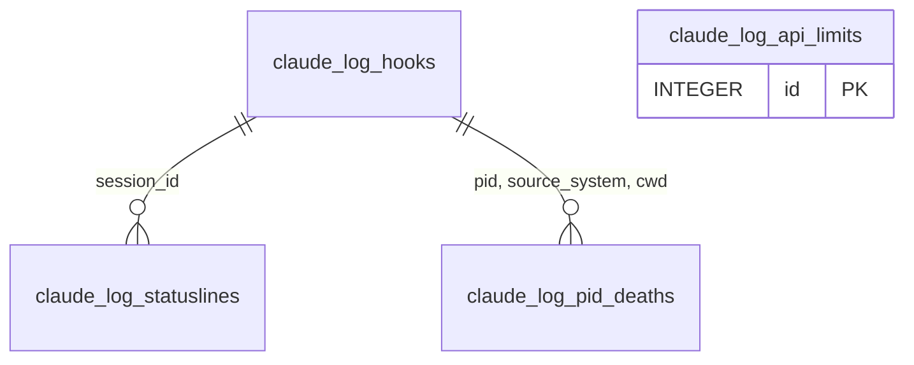
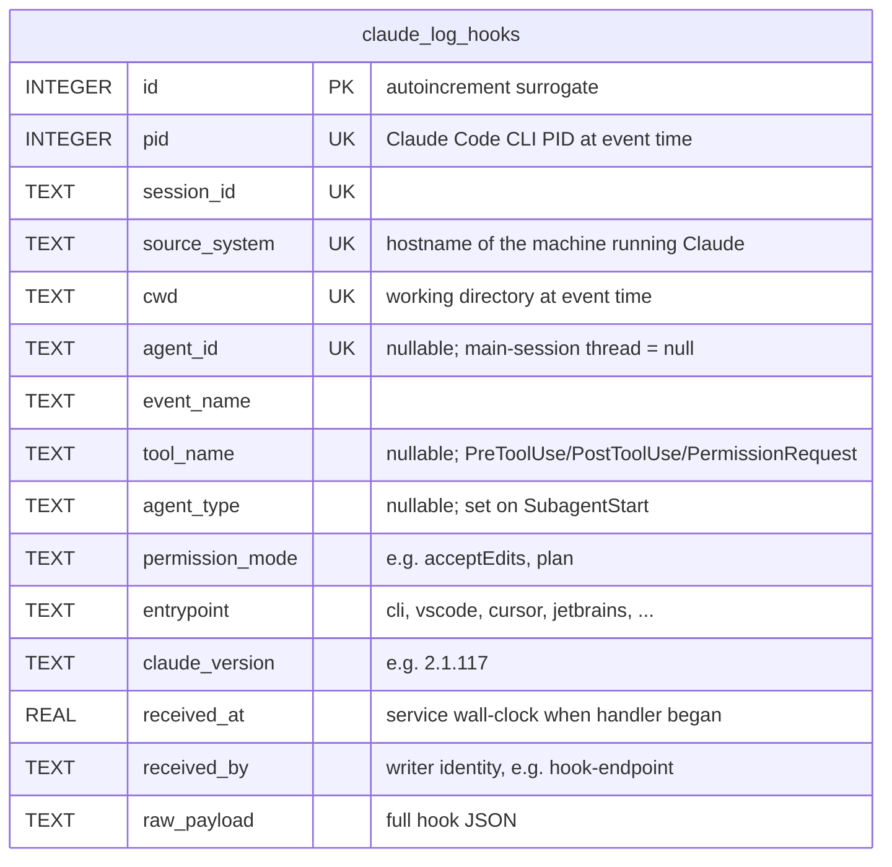
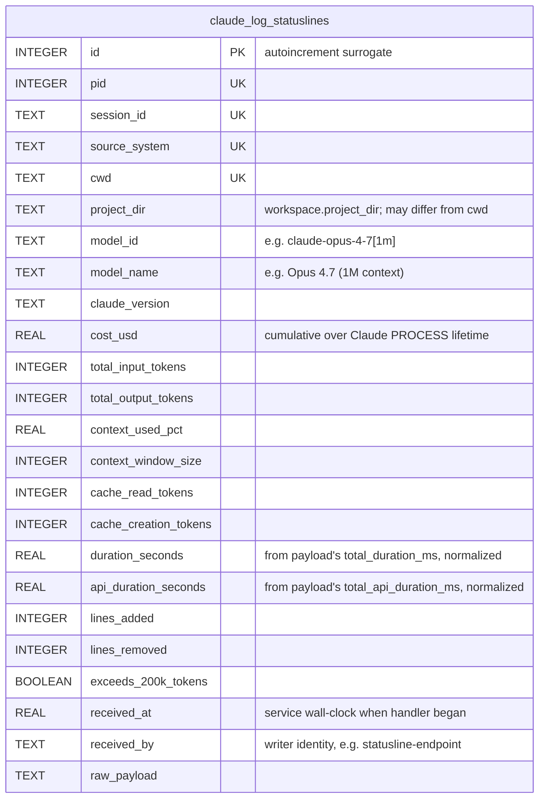
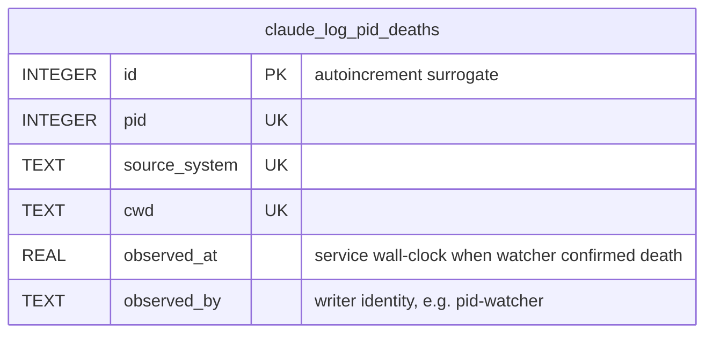
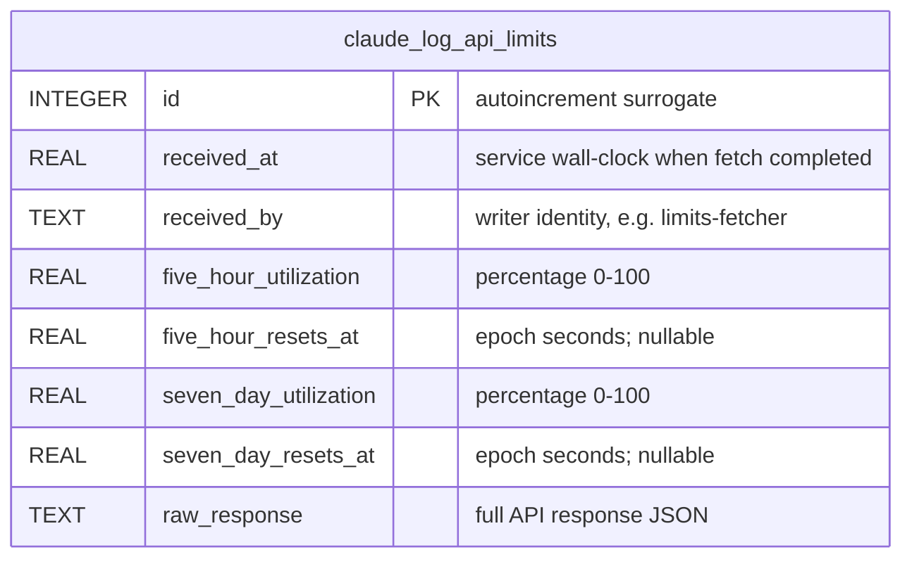

# Data Model — Proposed

Future-state data architecture. What entities we want to capture, what
each entity carries, and how they relate. No current-state comparison, no
migration plan, no query implementation — those are separate concerns.

## Naming convention

All append-only log tables are prefixed **`claude_log_`**. Any future
derived projection, materialized cache, or operational-state table uses
a different prefix (`claude_view_`, `claude_cache_`, `claude_state_`).
The `log_` marker tells a reader at a glance whether a table is
append-only (safe to scan, safe to snapshot, safe to rebuild from
upstream) or something more delicate.

## Design principles

1. **Every external signal is captured raw, exactly once, in its own
   log.** No upserts, no deletes. One channel, one table.
2. **Every row is self-describing.** Context needed to interpret a row
   is denormalized onto the row — `pid`, `source_system`, `cwd`,
   `entrypoint` travel with each event rather than living on a
   separately-updated "session" row.
3. **Higher-level entities (session, agent, process) are derived.**
   They are concepts the data model *describes*, not rows that are
   stored. Their current state is a projection over the logs.
4. **Process lifetimes are first-class, grounded in PID history.** A
   process is defined by a span of events sharing `pid` within a single
   `session_id` — an *epoch*. Resumes and PID reuse both resolve
   correctly because the PID stream is the source of truth.
5. **Time is normalized to one unit throughout.** Every stored
   timestamp is a `REAL` column holding **Unix epoch seconds** with
   fractional precision. Any payload value that arrives in milliseconds
   (e.g. statusline's `total_duration_ms`) is divided by 1000 at
   ingestion. Comparisons, arithmetic, and rendering become trivial;
   consumers never have to ask "what unit is this?"

## Design constraints

Deliberate limitations of the current model. These are the assumptions
a reader should check before assuming behavior outside their scope.

### Single Anthropic account

The data model assumes **one Anthropic account** per agentpulse
deployment. API usage limits, OAuth credentials, and any future
account-scoped fields are treated as implicit — not captured as a
column on any table.

Why this is a model-wide constraint, not a table-local one:
- Limits are account-scoped, but so are the credentials that drove
  the hook and statusline events. If a user switched between accounts
  mid-run, hooks and statuslines from different accounts would
  commingle in one log and there would be no way to demux them.
- The signals we capture today (hooks, statuslines, pid observations,
  limits) all have no native account identifier. Obtaining one would
  require decoding the opaque OAuth token or calling an identity
  endpoint — neither of which exists in the ingestion path today.
- Adding an `account_id` column to one table while leaving the others
  un-scoped would create a phantom dimension that can't be joined
  meaningfully.

If multi-account becomes a real need, the work is coordinated across
*every* log table — add `account_id` (or equivalent) everywhere,
source it at ingestion, and make consumers account-aware. Do not add
it piecemeal.

## Audit columns

Every log table carries:

- `id INTEGER PK` — autoincrement surrogate. Row uniqueness and stable
  ordering. Never reused, never mutated.
- A pair describing when the row was written and by whom:
  - **Wire-sourced logs** (`claude_log_hooks`, `claude_log_statuslines`,
    `claude_log_api_limits`): `received_at` (REAL seconds) +
    `received_by` (writer identity string). "We received this from the
    outside world at this moment."
  - **Observation-sourced logs** (`claude_log_pid_deaths`):
    `observed_at` + `observed_by`. "We looked out and observed this at
    this moment."

Append-only logs deliberately have **no `last_updated_*` counterparts**
— rows never mutate, so the absence is the signal that an UPDATE
against these tables is wrong.

## Entity overview

All relationships are logical — no referential integrity enforcement.
Data arrives out of order and sometimes for sessions that don't yet
exist, so the integrity is in the query, not the write.

`claude_log_api_limits` is shown standalone — it's not session-scoped.

## Log tables

### `claude_log_hooks`

One row per hook event emitted by Claude Code. Claude Code hooks cover
every observable runtime signal: tool calls, prompts, stops, session
start/end, subagent lifecycle, permission requests, notifications.

### Natural identity

The `id` column is the row PK (surrogate, autoincrement) — always
unique, never reused.

The composite `(pid, session_id, source_system, cwd, agent_id)` is a
**unique key on the actor concept**, not on individual rows. It
identifies a specific subagent (or the main-session thread when
`agent_id` is null) within a specific process lifetime, on a specific
machine, rooted in a specific working directory. Many rows share this
composite (one per event); SQL-level row uniqueness comes from `id`.

Marked as `UK` in the diagram because that composite is the natural
access key for queries like "all events from this actor."

**`cwd` is part of the identity** because downstream consumers present
data scoped by cwd — a project dashboard, a per-repo cost rollup, a
worktree-specific view. If `cwd` were omitted, a session resumed into a
different working directory (Claude permits this) would collide with
its original identity and corrupt the downstream view. Consequence of
including `cwd`: a resume across working directories creates two
distinct actor identities sharing the same `session_id`. That matches
what consumers already expect — "show me what happened in this
directory" is the natural presentation axis.

Notes:
- **No enum constraints.** `event_name`, `tool_name`, `agent_type`,
  `permission_mode`, and `entrypoint` are all free-text. Annotations in
  the diagram (e.g. "cli, vscode, cursor, jetbrains, ...") are
  illustrative examples, not schema constraints. Claude Code regularly
  introduces new values; writes must never fail because the field
  landed on an unfamiliar string.
- `pid` travels with every event so process-lifetime detection works
  even when the current pid differs from the original session's pid.
- `entrypoint` is captured per event (not per session) so a session
  resumed from a different launcher records its new entrypoint
  accurately.
- `agent_type` is populated on the introducing `SubagentStart` event.
  Later events for the same `agent_id` leave it null — the type is a
  property of the agent, not of each event.
- `received_at` is the service's wall clock at handler entry, not a
  DB-computed insert time. A few microseconds before the INSERT hits
  disk in practice. The name describes what happened (we received the
  POST at this time).
- `received_by` identifies the writer for audit (e.g. `hook-endpoint`).
  Append-only logs don't have `last_updated_*` counterparts — rows
  never mutate, so the absence is the signal that an UPDATE against
  this table is wrong.
- `raw_payload` is the escape valve: any future hook field lands here
  before the schema catches up.

### `claude_log_statuslines`

One row per statusline POST — emitted by Claude Code roughly once per
tool call, carrying cost/token/context snapshots. See
[`statusline-payload.md`](statusline-payload.md) for the full wire
shape.

Natural identity: `(pid, session_id, source_system, cwd)` — marked
`UK` in the diagram. Statuslines have no subagent dimension (only the
main CLI renders statuslines), so no `agent_id` component. Many rows
share this composite over time; row uniqueness is the `id` surrogate.

Notes:
- `pid` and `source_system` travel on each row so the process-epoch
  concept applies to statusline-only ingestion (statusline can arrive
  before the first hook for a session_id).
- `cost_usd` is **cumulative over a Claude process lifetime**, not per
  session. Persists across `/clear` within one process. Resets on
  `claude --resume` into a new process. See the *process epoch*
  concept below for how this is interpreted.
- `project_dir` is distinct from `cwd`: the workspace's logical root
  versus the current directory when Claude was launched. Both matter.
- `rate_limits` (bundled inside statusline payloads) is intentionally
  left in `raw_payload` only — the OAuth-API-sourced
  `claude_log_api_limits` stream is a cleaner source for that data.

### `claude_log_pid_deaths`

A PID's lifecycle is not a stream of events; it's an entity with a
birth and a death. First-observed and last-observed timestamps are
derivable from the hooks and statusline logs themselves
(`MIN(received_at)` / `MAX(received_at)` for rows matching the pid).
The one signal that *isn't* derivable from activity logs is the
**death** — absence of hooks doesn't prove a PID is gone; it might
just be idle. The watcher provides that signal.

So: rather than model the full PID lifecycle here, capture only the
discrete events that can't be derived elsewhere — observations that
a watcher made about a PID's demise or replacement.

Natural identity: `(pid, source_system, cwd)` — marked `UK` in the
diagram. Identifies a process instance (machine + cwd + PID). Note
that multiple death rows can share this composite when a PID is reused
over time; the composite identifies the *process-instance concept*,
not a specific death event. Each row is a discrete death observation,
ordered by `observed_at`; disambiguating which death belongs to which
instance uses the `observed_at` timeline plus activity gaps in the
hooks/statuslines logs.

Notes:
- The table's scope *is* deaths — every row asserts "this process
  instance is gone, as observed by this writer at this moment." No
  kind/type/observation column is needed; the signal is the row's
  existence.
- What counts as death is up to the watcher. The current PID watcher
  would write a row for: the OS reports no process at that PID, or
  the OS reports a process at that PID whose image doesn't match the
  Claude instance we were tracking (PID reuse, from our perspective:
  our process is dead). Future watchers can add detection paths
  without schema changes — the output is the same row shape.
- If a future need arises to capture *evidence* or *detection reason*
  for diagnostics (not for decision-making), it can land as an
  additional column later. Leaving it out keeps the table lean until a
  consumer needs it.
- `source_system` and `cwd` travel on the row so each death is
  self-describing without joining back to hooks.
- `observed_at` and `observed_by` follow the same naming convention as
  `received_at` / `received_by` elsewhere — different prefix because
  the watcher is *observing* a process out in the world, not
  *receiving* a payload over the wire.

### `claude_log_api_limits`

One row per successful pull from the Anthropic OAuth usage-limits API.
Not session-scoped and not machine-scoped. Limits belong to the
Anthropic account — the same account used from multiple machines
shares one pool. Account scope is deliberately implicit here; see
**Single Anthropic account** under *Design constraints*.

No natural-identity composite. Each row is one fetch event;
uniqueness is the `id` surrogate. Account scope is handled at the
model level (see **Single Anthropic account** under *Design
constraints*), not on this table.

Notes:
- Extracted columns cover the two buckets consumers care about today:
  `five_hour` and `seven_day`. Other buckets in the API response
  (`seven_day_opus`, `seven_day_sonnet`, `seven_day_oauth_apps`,
  `extra_usage`, and a handful of variants) live in `raw_response` and
  can be promoted to columns if a consumer needs them.
- `resets_at` fields arrive from the API as ISO 8601 strings (e.g.
  `"2026-04-24T02:30:00.202303+00:00"`) and are normalized to epoch
  seconds at ingestion per the time-normalization principle.
- `five_hour_resets_at` and `seven_day_resets_at` are nullable — the
  API returns `null` when the bucket hasn't been used recently enough
  to have an active reset timer.
- `received_at`/`received_by` follow the same convention as the other
  log tables; the fetcher is the writer for this stream. If attribution
  of *which machine did the fetch* becomes useful for ops/debugging,
  it can land as an optional `fetched_by_system` column — separate
  concern from account scoping.

## Derived concepts

None of the following are stored. They are the domain concepts the logs
describe. A query helper or SQL view computes them on demand.

### Session

Identified by `session_id`. Its current state is the latest row in
`claude_log_hooks` for that session_id (with statusline enrichment
from the latest `claude_log_statuslines` row).

### Agent

Identified by `agent_id`. Current state is the latest
`claude_log_hooks` row for that agent_id. Lifetime is bounded by
`SubagentStart`/`SubagentStop` events for the same `agent_id`.

### Process epoch

A **process epoch** is a contiguous span of rows sharing the same
`(session_id, pid)` with no interruption. A pid change within a
session_id starts a new epoch — this is the hallmark of
`claude --resume` into a new process.

Each epoch has:
- `session_id`
- `pid`
- `source_system`, `cwd`, `entrypoint` (from the rows in the epoch)
- `started_at` = min(received_at) within the span
- `ended_at` = max(received_at) within the span, or null if ongoing.
  A matching `claude_log_pid_deaths.observed_at` (if present) firms
  this up into a definitive end rather than a "most recent activity"
  approximation.

### Process

A **process** is the union of epochs that belong to the same Claude
Code process lifetime. A single Claude process can host multiple
sessions (every `/clear` mints a new session_id within the same
process), so one process covers N session_ids.

Process identity:
- Epochs sharing `(pid, source_system, cwd)` whose time windows do
  not overlap are **distinct processes** (PID reuse).
- Epochs sharing `(pid, source_system, cwd)` whose time windows
  overlap or are contiguous are the **same process**.

Cumulative cost for a process = the max `cost_usd` observed in
`claude_log_statuslines` within the process's time window (monotonic
by construction).

## Future entities

Captured here so the namespace stays coherent when these land:

- **`claude_log_external_costs`** — future ingestion from external cost
  feeds (e.g. ccusage-style daily rollups). Shape TBD; would carry
  `source_system`, `recorded_at`, and cost/token breakdowns. Not added
  to the data model until a writer exists.
- **`claude_view_*`** — materialized projections (session list,
  process list) for fast reads. Added only if log-query latency
  becomes unacceptable in practice.
