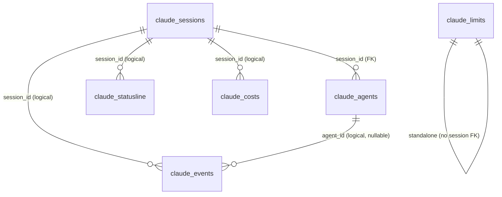
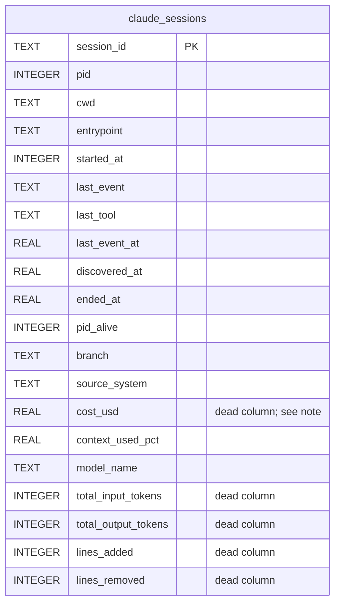
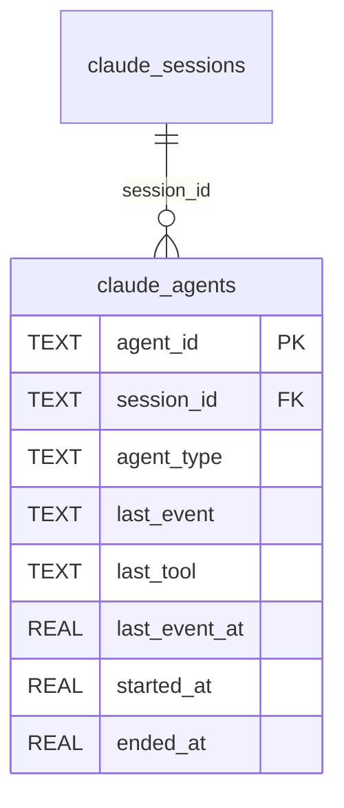
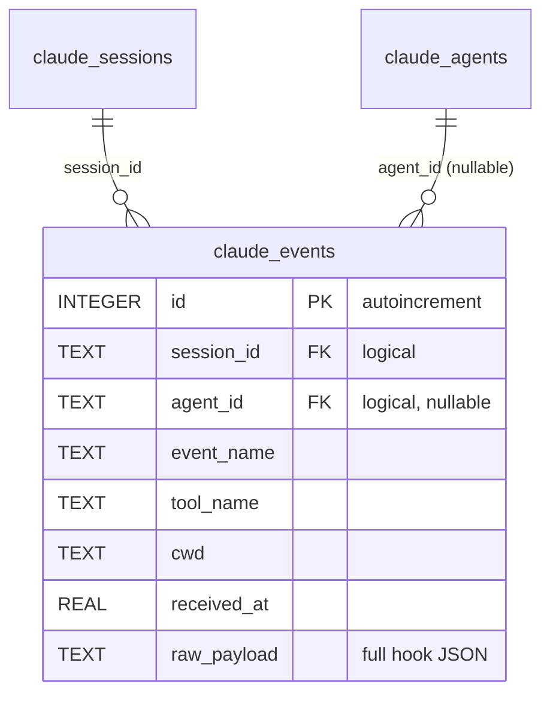
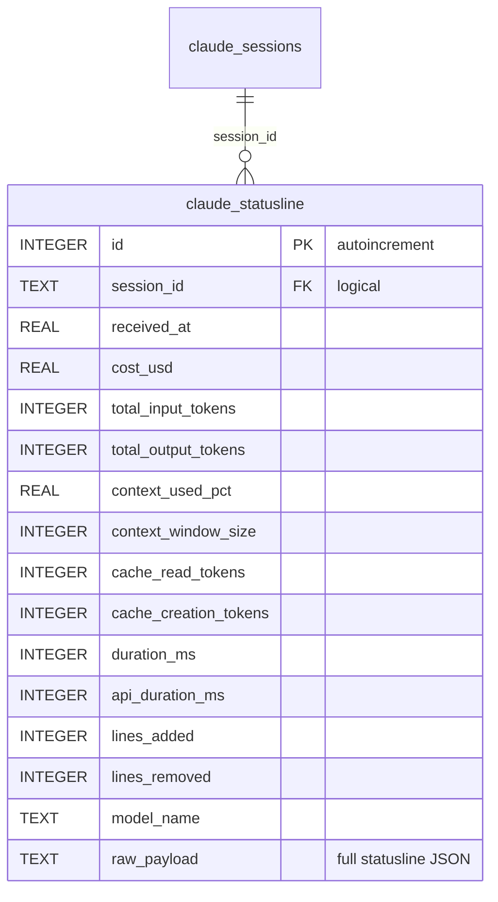
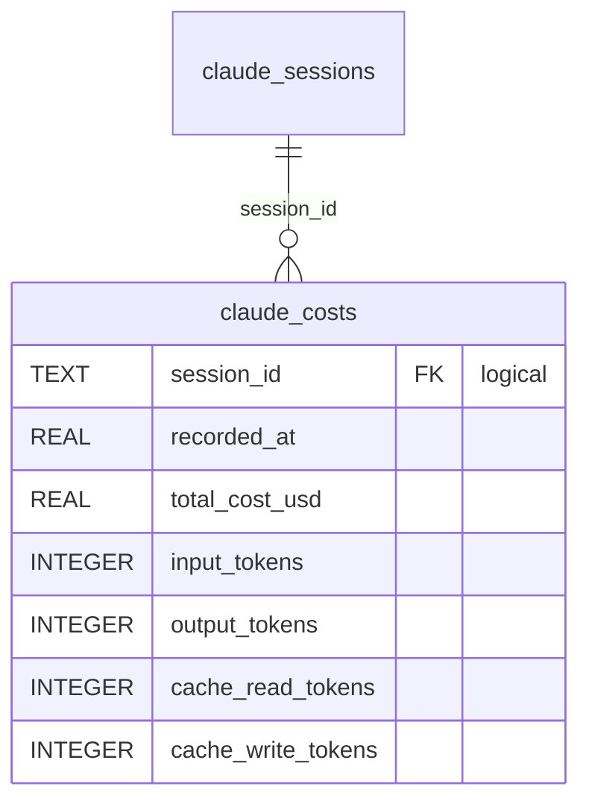
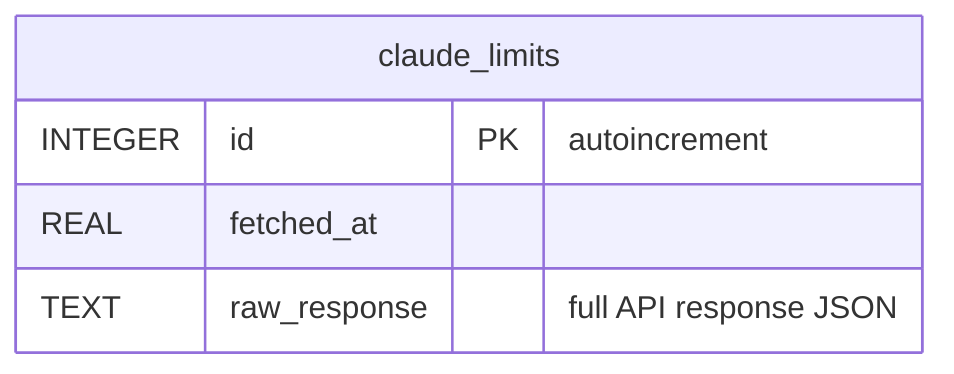

# Database Schema

AgentPulse uses a single SQLite database (default `~/.claude/agentpulse/agentpulse.db`,
WAL mode) with tables scoped per platform. All current tables are prefixed
`claude_` — future platforms get their own prefix.

- **Location**: `config.db_path` in `~/.claude/agentpulse/config.json`.
- **Journaling**: WAL. Snapshots taken while the service runs **must** use
  `sqlite3 <db> ".backup <dest>"` or copy all three of `.db`, `.db-wal`,
  `.db-shm`. A bare `cp` of only the `.db` file misses uncommitted WAL pages.
- **Migrations**: none today. Schema changes that alter an existing column
  require dropping the DB or writing a one-off migration.
- **Definitions**: [`src/agentpulse/platforms/claude/schema.py`](../src/agentpulse/platforms/claude/schema.py).

## Entity-relationship overview

Notes on relationships:

- `claude_agents.session_id` is the only **enforced** foreign key.
- `claude_events.session_id`, `claude_statusline.session_id`, and
  `claude_costs.session_id` are **logical** references — no FK constraint, so
  rows can arrive for unknown sessions (e.g. a statusline row for a
  `session_id` the hook path hasn't created yet).
- `claude_events.agent_id` is nullable; when non-null it references an
  `agent_id` in `claude_agents`, also logical.
- `claude_limits` is not session-scoped — one global stream of API limit
  snapshots.

## Tables

### `claude_sessions`

Current-state snapshot for each Claude Code session. **Single row per
`session_id`**, updated via upsert on each hook event. This is a "latest
state" view, not a log — fields like `pid`, `last_event`, `pid_alive` are
overwritten.

- **`pid`**: reflects the *latest* hook's parent PID. A session resumed via
  `claude --resume <id>` in a new process overwrites the original PID, so
  this field alone can't distinguish process lifetimes.
- **`started_at`**: Unix epoch **milliseconds** (one of two fields that use
  ms — everything else is seconds).
- **`discovered_at`**, **`last_event_at`**, **`ended_at`**: Unix epoch
  seconds.
- **`pid_alive`**: 0/1. Set to 0 by the discovery loop when
  `psutil.pid_exists(pid)` returns false.
- **`cost_usd`, `total_input_tokens`, `total_output_tokens`, `lines_added`,
  `lines_removed`**: retained for existing DBs but **not written** by
  current code. Cumulative metrics live in `claude_statusline` and are
  computed at query time for the enclosing process.

### `claude_agents`

Subagents spawned inside a session. Single row per `agent_id`, upserted on
each subagent hook event.

- `session_id` is a real FK to `claude_sessions`.
- `agent_type` is the agent template name (e.g. `Explore`, `code-reviewer`).
- `ended_at` is set when a `SubagentStop` hook fires or when the enclosing
  session is cleared.

### `claude_events`

**Append-only** log of every hook event the service receives. The full
payload is preserved in `raw_payload` as JSON.

- Indexes: `idx_claude_events_session(session_id)`,
  `idx_claude_events_received(received_at)`.
- `raw_payload` contains every field the hook relay sent, including `pid`
  and `source_system`. These are **not** extracted into indexed columns
  today — callers that need them parse `raw_payload` JSON.
- `received_at` is the service's wall clock at ingestion, not Claude's
  timestamp from the payload.

### `claude_statusline`

**Append-only** log of statusline snapshots. Fires roughly once per tool
call. Source of truth for cumulative per-process metrics (cost, tokens,
lines).

- Indexes: `idx_claude_statusline_session(session_id)`,
  `idx_claude_statusline_received(received_at)`.
- Statusline rows for unknown `session_id`s are **stored** (for retroactive
  stitching once the hook creates the session) but the endpoint returns
  `{"status": "deferred"}`.
- `cost_usd` is reported by Claude Code and is **not monotonic across all
  rows for a session_id**: a `claude --resume` starts a new process with a
  fresh $0 counter, producing a decrease. Per-process-lifetime, the counter
  is monotonic.

### `claude_costs`

Stub table for a future external cost-ingestion path (e.g. `ccusage`-style
feeds). The current `POST /costs/claude` endpoint returns 501. The table
exists so the shape is stable.

No indexes, no enforcement, no writers in production today.

### `claude_limits`

Snapshots of the Anthropic OAuth API's usage-limits response. Populated only
when `fetch_limits: true` in config. Not tied to any session.

- Index: `idx_claude_limits_fetched(fetched_at)`.
- The most recent row services both the REST endpoint (`/api/v1/limits`)
  and the WebSocket `limits_updated` broadcast.

## Writing conventions

| Surface | Writes                                                                |
|---|---|
| `POST /hooks/claude` | upsert `claude_sessions`; upsert/end `claude_agents`; append `claude_events` |
| `POST /statusline/claude` | append `claude_statusline`; update `claude_sessions.context_used_pct` and `model_name` (if session exists) |
| discovery loop | update `claude_sessions.pid_alive`, `claude_sessions.ended_at` |
| limits fetch loop | append `claude_limits` |
| `POST /api/v1/sessions/{id}/clear` | clear event fields on `claude_sessions`; end active agents in `claude_agents`; append synthetic `clear_state` row in `claude_events` |

## Known limitations

- **Session row overwrites lose process-lifetime history.** The stored
  `pid` on a `claude_sessions` row is the most recent one seen. If a session
  is resumed from a new process, the original PID is lost. The underlying
  hook payloads preserve this in `claude_events.raw_payload`, but it isn't
  indexed for query.
- **Grouping by `(pid, source_system, cwd)` can collide.** Windows PID
  reuse and same-session resume into a different PID both break the
  one-group-one-process invariant. A reset-aware algorithm reading
  `claude_events` pid history per session is the planned fix.
- **No migrations.** Adding columns to existing tables requires dropping
  the DB or writing an ad-hoc migration. `CREATE TABLE IF NOT EXISTS` in
  `schema.py` only helps fresh databases.
