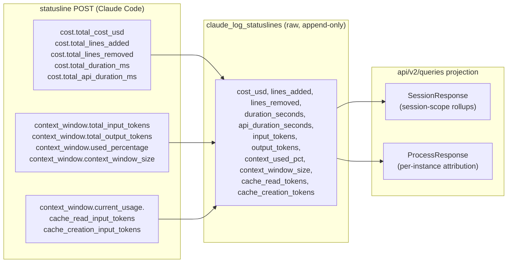
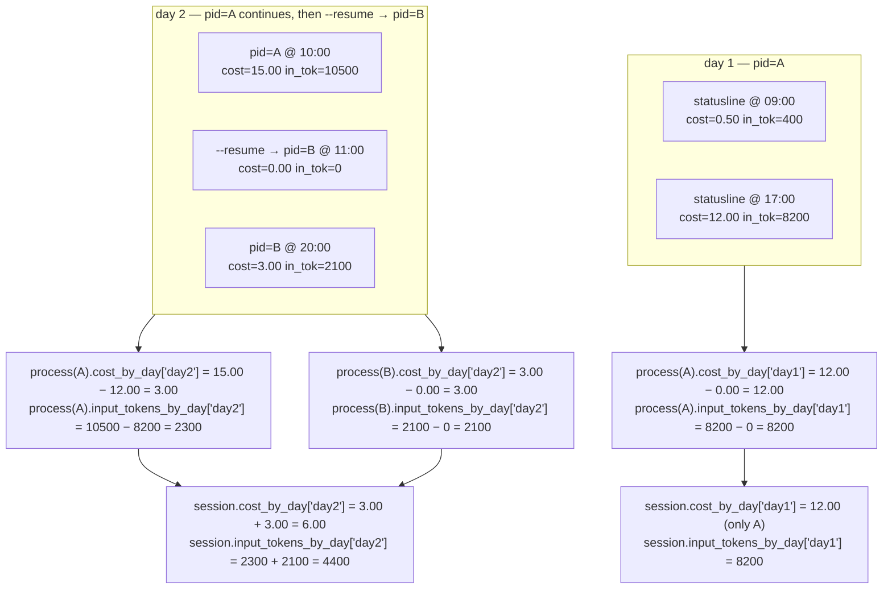

# Accounting — Cost, Tokens, Lines, Durations

How AgentPulse models the *measurable consumption* signals that ride
along on Claude Code statusline payloads — what they are, where they
come from, what scope they accumulate over, when they reset, and how
they get projected onto day-bucketed views.

Companion to [`database.md`](database.md) (storage shape) and
[`api.md`](api.md) (response shape). This doc is the source of truth
for accounting semantics. Anything in another doc or in source-code
docstrings that contradicts this one is **stale and must be updated**;
a list of known stale claims to fix is in *Stale claims to clean up*
at the end.

## Why this exists

Clients reporting on Claude usage tend to pivot by **day** — "what
did I spend yesterday," "how many tokens did this project burn
today." Pre-aggregating along that axis is what makes those reports
fast and consistent across the dashboard, REST API, and WebSocket
broadcasts.

This is not a commitment to day as the *only* pivot. Hourly rollups,
weekly rollups, or arbitrary windows can be added later from the same
raw `claude_log_statuslines` table — the data is there. Day is just
the first one we project because it's what every client wants today.

Today only `cost_usd` gets that treatment. Tokens, lines, and
durations are surfaced as "latest snapshot" only, with no day
attribution and no per-process attribution. That's an inconsistency
the UI inherits and this doc addresses.

This doc:

1. Names every accounting value the platform carries.
2. States the scope each one accumulates over and where it resets,
   **validated empirically against `oneshot/agentpulse.db`** rather
   than asserted from prior assumptions.
3. Calls out where the projection layer is missing or inconsistent.
4. Specifies the day-boundary projection so the same pattern lands
   on every cumulative metric.
5. Resolves the field-naming drift between statusline log rows,
   `ProcessResponse`, `SessionResponse`, and `statusline_logged`
   broadcasts.
6. Specifies the storage migration to drop the `total_` prefix from
   log columns so storage and projection layers share one rule.

## Source signal: statusline payload

The accounting fields live on the statusline POST. Two upstream
parents:

- `cost.*` — cumulative work-output counters (cost, lines, durations).
- `context_window.*` — current context state (cumulative tokens) plus
  `current_usage.*` (per-event token deltas).

See [`../reference/statusline-payload.md`](../reference/statusline-payload.md)
for the full wire shape. That doc is correct on
`cost.total_cost_usd` semantics; this doc and that one agree.



Storage column names in the diagram reflect the post-migration shape
(see *Storage migration*). Today's columns still carry `total_` on
the token fields; the migration is in scope of this design.

## Catalog

Every accounting field surfaced today, plus what's missing.

| Field (post-migration column) | Source path on payload | Type | Cumulative scope | Resets at |
|---|---|---|---|---|
| `cost_usd` | `cost.total_cost_usd` | REAL USD | Process lifetime within session | New PID (`--resume`); end of process |
| `lines_added` | `cost.total_lines_added` | INTEGER | Process lifetime within session | New PID; end of process |
| `lines_removed` | `cost.total_lines_removed` | INTEGER | Process lifetime within session | New PID; end of process |
| `duration_seconds` | `cost.total_duration_ms` ÷ 1000 | REAL seconds | Process lifetime within session | New PID; end of process |
| `api_duration_seconds` | `cost.total_api_duration_ms` ÷ 1000 | REAL seconds | Process lifetime within session | New PID; end of process |
| `input_tokens` | `context_window.total_input_tokens` | INTEGER | Process lifetime within session | New PID; `/clear` (new session_id) |
| `output_tokens` | `context_window.total_output_tokens` | INTEGER | Process lifetime within session | New PID; `/clear` |
| `cache_read_tokens` | `context_window.current_usage.cache_read_input_tokens` | INTEGER | **Per-event** (NOT cumulative) | Every statusline POST is a fresh point-in-time snapshot |
| `cache_creation_tokens` | `context_window.current_usage.cache_creation_input_tokens` | INTEGER | **Per-event** (NOT cumulative) | Every statusline POST is a fresh point-in-time snapshot |
| `context_used_pct` | `context_window.used_percentage` | REAL 0–100 | Point-in-time gauge | N/A — read latest |
| `context_window_size` | `context_window.context_window_size` | INTEGER | Configuration | N/A — read latest |
| `exceeds_200k_tokens` | `exceeds_200k_tokens` | BOOLEAN | Point-in-time flag | N/A — read latest |

The `current_usage.input_tokens` and `current_usage.output_tokens`
fields exist on the wire (per-event, like the cache fields) but are
**not currently stored**. They could be added if a "tokens this turn"
metric becomes useful; flagged here so the choice isn't silently
forgotten.

### Three categories

The catalog above sorts into three buckets, and each gets a different
treatment downstream:

1. **Cumulative-within-process metrics.** `cost_usd`, `lines_added`,
   `lines_removed`, `duration_seconds`, `api_duration_seconds`,
   `input_tokens`, `output_tokens`. These are the day-splittable
   metrics. Their day delta is computable as `MAX(in window) − MAX(prior
   window)` within a single PID.
2. **Per-event metrics.** `cache_read_tokens`, `cache_creation_tokens`.
   No baseline subtraction — a daily total is `SUM(metric)` over rows
   in the day. Treated like a histogram, not a counter. We do **not**
   fabricate a cumulative counter for these; see *Cache tokens: why
   we don't synthesize a cumulative counter*.
3. **Point-in-time gauges.** `context_used_pct`, `context_window_size`,
   `exceeds_200k_tokens`. Latest-value-wins. Never aggregated to a day
   bucket.

## Empirical validation against the snapshot

These claims were checked against `oneshot/agentpulse.db`. The
inspection script lives at `scripts/explore/inspect_accounting.py`
and is reproducible; rerun after future snapshots to confirm
behavior hasn't drifted.

### Cost does **not** carry across `--resume`

In every recent multi-PID session in the snapshot, the resumed PID's
first statusline rows show `cost_usd = 0.0`:

```
session f7c3bf1c (cwd: my-claude-stuff)
  pid=51148 80 rows  cost min=10.2526  max=14.0562
  pid=8872   3 rows  cost min= 0.0000  max= 0.0000   ← resume

session f529d832 (cwd: agentpulse)
  pid=41432 102 rows cost min= 1.4659  max=29.7789
  pid=40856   3 rows cost min= 0.0000  max= 0.0000   ← resume

session 4752e2fb (cwd: personal-assistant-dashboard)
  pid=20468  50 rows cost min= 2.4665  max= 5.7511
  pid=47348   1 row  cost min= 0.0000  max= 0.0000   ← resume
```

Same pattern for tokens, lines, durations: the resumed PID starts
fresh.

```
session f7c3bf1c
  pid=51148  in=[16622,16884]  out=[107689,133614]  lines+=[625,824]
  pid=8872   in=[    0,    0]  out=[     0,     0]  lines+=[  0,  0]
```

**`cost_usd` is process-cumulative within session, scoped to a single
PID.** Nothing rolls forward across `--resume`. Same for
`input_tokens`, `output_tokens`, `lines_added`, `lines_removed`,
`duration_seconds`, `api_duration_seconds`.

### Historical anomalies (legacy SDK / older Claude Code)

A handful of older sessions in the snapshot show different behavior —
cost values appearing to carry across PID boundaries:

```
session 0c5033dd (older)
  pid=52084 cost max= 0.5844
  pid=42528 cost min= 0.5844 ← starts at prior PID's max
  pid=10292 cost min= 0.5844 ← also starts at prior max
  pid=43556 cost min= 0.5844
```

Attributing to the SDK-based ingestion path that predated the
current statusline relay (per project history). The current Claude
Code CLI does not exhibit this behavior.

**Implication:** the design treats cost as process-scoped without
exception. Code paths that try to detect `is_resumed` and apply a
"session inherited cost" baseline (currently in
`api/v2/queries/sessions.py` and `api/v2/queries/processes.py`) are
solving a problem that no longer exists for current data. Once the
projection layer is reworked per this design, that baseline logic
goes away.

### Cache tokens: per-event with cache-state continuity across `--resume`

Cache token values often appear identical at the boundary between
two PIDs of the same resumed session:

```
session f7c3bf1c
  pid=51148 last:  cr=138870  cc=  612
  pid=8872  first: cr=138870  cc=  612   ← identical
```

This is **not** counter carry-over. It's the Anthropic-side prompt
cache being warm: the resumed process's first message reads from the
same server-side cache the prior process populated. Each row is
still a per-event snapshot of "what cache did this message use."
Consecutive rows within one PID confirm the per-event nature:

```
session 65b44372 pid=18072 (consecutive)
  cache_r:  0 → 0 → 0 → 44540 → 44540 → 48952 → 49880 → 50744 → 21622 → 71959
  cache_c:  0 → 44540 → 44540 → 4412 → 4412 → 928 → 864 → 16097 → 50337 → 3169
```

`cache_creation_tokens` does not accumulate at all — it's the count
written for *this* message. `cache_read_tokens` trends upward as
older messages get re-read but resets when context is trimmed.
Neither one is monotonic.

## Cache tokens: why we don't synthesize a cumulative counter

Per-event metrics could in principle be SUMmed to a per-day or
per-process total. The question is whether such a sum is meaningful.

**Anthropic charges for cache tokens.** Cache reads cost 0.1× the base
input token price (a 90% discount); cache writes cost 1.25× (5-minute
cache) or 2× (1-hour cache). They are real, billable consumption.

But they overlap nothing usefully:

- The dashboard already shows **`cost_usd`** — that's the bottom-line
  spend. The cache pricing is already baked in.
- The dashboard shows **`input_tokens` + `output_tokens`** — that's
  the raw work signal. Cache tokens are a *separate category* of
  input tokens (Anthropic counts non-cached input, cache reads, and
  cache writes as three distinct buckets), so they don't bloat
  `input_tokens` if you're careful to keep them in their own column.

A SUM over a day of `cache_read_tokens` answers "how many tokens
were read from cache today" — useful for cache hit rate analysis,
not for "how much did I spend" or "how much work did Claude do."

**Decision:** project per-day SUMs (`cache_read_tokens_by_day`,
`cache_creation_tokens_by_day`) **only** when a consumer specifically
needs cache analysis. They are **not** included in any "tokens used
today" headline. The dashboard's tokens-today number is
`input_tokens` + `output_tokens` only.

If a use case never materializes, leave them un-projected — they're
already on `claude_log_statuslines` and on the WS broadcast for
clients that want raw access.

## What's projected today

| Surface | cost | tokens (input/output) | lines | duration |
|---|---|---|---|---|
| `claude_log_statuslines` row | yes (raw `cost_usd`) | yes (raw `total_input_tokens`, `total_output_tokens`, `cache_*`) | yes (`lines_*`) | yes (`*_duration_seconds`) |
| `SessionResponse` | `total_cost_usd` (session scalar) + `cost_by_day` | **missing** | **missing** | **missing** |
| `ProcessResponse` | `cost_usd` (per-instance) + `cost_by_day` | `total_input_tokens` / `total_output_tokens` (latest snapshot, NOT day-split, NOT process-attributed) | `lines_added` / `lines_removed` (latest snapshot, same caveats) | **missing** |
| `statusline_logged` WS frame | per-row `cost_usd` + `session_total_cost_usd` + `session_today_cost_usd` | `total_input_tokens`, `total_output_tokens`, `cache_*` (raw passthrough) | `lines_added`, `lines_removed` (raw) | `duration_seconds`, `api_duration_seconds` (raw) |

Three kinds of inconsistency to resolve:

1. **Session-vs-process asymmetry.** Session carries cost rollups
   (total + by-day) but no tokens or lines. Process carries cost
   rollups *and* token/line snapshots — but the snapshots are the raw
   latest statusline value, not a per-instance-windowed projection.
2. **Day-bucket coverage.** `cost_by_day` exists. `*_by_day` for
   tokens, lines, and durations does not.
3. **Cost projection logic is over-engineered for behavior that
   doesn't happen.** The `is_resumed` baseline detection in both
   `sessions.py` and `processes.py` exists to handle "cost carried
   across resume." Empirically that doesn't happen anymore. The
   projection simplifies to "cost per process, summed across the
   processes in the session."

## Naming inconsistencies and the standard

Two related problems: prefix drift between the source payload, the
log row, and the projections; and entity-scope ambiguity at the
projection layer.

### Prefix drift (current state)

| Source field | Current log column | Current ProcessResponse | Current SessionResponse |
|---|---|---|---|
| `cost.total_cost_usd` | `cost_usd` | `cost_usd` | `total_cost_usd` ← drift |
| `cost.total_lines_added` | `lines_added` | `lines_added` | (missing) |
| `cost.total_duration_ms` | `duration_seconds` | (missing) | (missing) |
| `context_window.total_input_tokens` | `total_input_tokens` ← still has prefix | `total_input_tokens` | (missing) |
| `context_window.current_usage.cache_read_input_tokens` | `cache_read_tokens` | (raw passthrough on WS only) | (missing) |

The `total_` prefix is dropped from `cost.total_*` and from
`*_input_tokens` on cache columns, but kept on
`context_window.total_input_tokens`. There is no rule.

### Entity-scope ambiguity

`SessionResponse.total_cost_usd` and `ProcessResponse.cost_usd` carry
the same word ("cost") but different semantics:

- `SessionResponse.total_cost_usd` = a session-scope rollup across
  every process the session has spanned.
- `ProcessResponse.cost_usd` = MAX(cost_usd in this instance window).

A reader who treats them as the same number will double-count. Same
risk applies to the as-yet-unprojected token/line metrics if they
land without a naming rule.

### The standard: drop `total_` everywhere

Going with the cleanest rule: **drop `total_` from every column and
every entity field. The wire keeps its prefix because Anthropic owns
that name; we strip it at the boundary.**

Rules:

1. **Log column = source field with units normalized AND prefix
   stripped.** `cost_usd` (was `cost.total_cost_usd`), `lines_added`,
   `duration_seconds`, `input_tokens`, `output_tokens`. Existing
   columns that already follow this rule (cost, lines, duration) stay
   as-is. Existing columns that don't (`total_input_tokens`,
   `total_output_tokens`) get migrated; see *Storage migration*.
2. **Entity response field = scope-implicit short name.**
   `ProcessResponse.cost_usd`, `SessionResponse.cost_usd`,
   `SessionResponse.input_tokens`, `ProcessResponse.input_tokens`.
   Drop the `total_` because the entity *is* the scope.
3. **Day-bucket field = `<metric>_by_day`.** `cost_by_day`,
   `input_tokens_by_day`, `lines_added_by_day`,
   `duration_seconds_by_day`. Values are per-day deltas summing
   back to the entity total.
4. **Today's scalar = `today_<metric>`.** Already used on the WS
   broadcast (`session_today_cost_usd`). On entity responses:
   `SessionResponse.today_cost_usd`, `ProcessResponse.today_cost_usd`.
5. **WebSocket broadcast fields keep their entity prefix** because
   they live outside an entity envelope: `session_cost_usd`,
   `session_today_cost_usd`, `session_input_tokens`,
   `process_cost_usd`. The frame doesn't carry an entity object, so
   the field name has to encode the scope.

### Why not align storage column names with the wire

Considered and rejected. The wire keeps `total_` because Anthropic
chose it. Storage and entity-response layers serve internal
consumers, where `total_` is redundant given the column already lives
in a per-row context (the row IS the snapshot; "total" is implicit).
Internal consistency wins over wire-mirror consistency because the
internal layer is where every consumer reads from. The boundary
inserter pays the rename cost once.

### Breaking-change posture

`SessionResponse.total_cost_usd` → `SessionResponse.cost_usd` and
`statusline_logged.session_total_cost_usd` →
`statusline_logged.session_cost_usd` are wire-breaking renames.
`claude_log_statuslines.total_input_tokens` →
`input_tokens` is a storage-breaking rename.

Acceptable. AgentPulse has a single client (the dashboard)
maintained alongside the service, no external versioned contract,
and we are adding several net-new fields in the same migration —
renaming one or two existing ones in the same change is the right
moment to pay that cost. No deprecation-window shim.

## Storage migration

In scope. The asymmetry between `cost_usd` (no prefix) and
`total_input_tokens` (still prefixed) carries cognitive cost
indefinitely; one well-defined migration removes it for good. Doing
nothing means the next contributor reading `claude_log_statuslines`
has to remember which columns dropped the prefix and which didn't.

### Approach: in-place rename

SQLite ≥ 3.25 (2018-09-15) supports `ALTER TABLE … RENAME COLUMN`,
which renames the column atomically and updates every dependent
index, view, and trigger automatically. No add-copy-drop dance, no
manual index recreation, no data loss risk. AgentPulse runs on
modern Python's bundled sqlite3, comfortably past 3.25.

Migration steps for `claude_log_statuslines`:

1. `ALTER TABLE claude_log_statuslines RENAME COLUMN total_input_tokens TO input_tokens;`
2. `ALTER TABLE claude_log_statuslines RENAME COLUMN total_output_tokens TO output_tokens;`

That's it. Indexes referencing those columns (none today, but the
same ALTER would cover any future ones) update automatically.

### Where the migration runs

The DB initialization path in `db.py` currently creates tables with
`CREATE TABLE IF NOT EXISTS` only — no migration system exists yet
(per CLAUDE.md "Schema changes require dropping the DB if tables
already exist"). The accounting work is the first change that needs
to migrate live data, so a thin migration step is justified:

- On startup, after `create_tables`, check
  `PRAGMA table_info(claude_log_statuslines)` for the presence of
  `total_input_tokens`. If found, run the two ALTER statements.
- Idempotent by design: subsequent runs see no `total_input_tokens`
  and do nothing.
- Update `SCHEMA_VERSION` accordingly and stop documenting the
  drop-DB workaround.

This is **not** the start of a general migration framework — it's
one targeted rename. If the next schema change also needs migrating,
that's the moment to introduce a real versioned migration runner.

## Day-boundary projection design

The dashboard needs day-bucketed deltas for every cumulative-within-
process metric. Design point: **the same code path projects every
metric**, parameterized on the column name.

### Scope: process, not session

Because `cost_usd` (and tokens, lines, durations) is process-
cumulative scoped to a single PID, the natural projection is:

- **Process scalar** = MAX(metric) over rows in this instance window.
  No baseline subtraction needed; the PID started fresh.
- **Process by-day** = MAX(metric in day) − MAX(metric through
  previous day, within the same PID), within the instance window.
  No cross-PID baseline.
- **Session scalar** = SUM of process scalars across every process
  the session spanned. (NOT a single MAX across the session — that
  loses contributions from later processes when the latest PID
  hasn't accumulated to the prior PID's max.)
- **Session by-day** = SUM of process-by-day maps merged on the day
  key.

This is significantly simpler than today's `is_resumed` baseline
detection. The detection exists because the current code assumes
session-cumulative; with process-cumulative scope confirmed
empirically, baselines fall away.

### Generalized helper

```python
async def process_metric_by_day(
    db,
    *,
    pid: int,
    source_system: str,
    cwd: str,
    after: float | None,
    until: float | None,
    metric_column: str,           # 'cost_usd', 'input_tokens', ...
) -> dict[str, float | int]:
    ...
```

`tokens_by_day`, `input_tokens_by_day`, `output_tokens_by_day`,
`lines_added_by_day`, `lines_removed_by_day`,
`duration_seconds_by_day`, and `api_duration_seconds_by_day` are all
calls to that one helper with a different column.

The session-level helper is `sum-merge across processes`:

```python
async def session_metric_by_day(
    db, *, session_id: str, metric_column: str
) -> dict[str, float | int]:
    out = defaultdict(<scalar zero>)
    for proc in processes_for_session(session_id):
        for day, delta in process_metric_by_day(proc, metric_column).items():
            out[day] += delta
    return dict(out)
```

### Per-event (cache) by-day

For `cache_read_tokens` / `cache_creation_tokens`, a SUM over rows
in the day. Different SQL, different function name on purpose so
contributors don't accidentally route a per-event metric through
the cumulative helper.

```sql
SELECT date(received_at, 'unixepoch', 'localtime') AS day,
       SUM(cache_read_tokens) AS total
FROM claude_log_statuslines
WHERE session_id = ? AND cache_read_tokens IS NOT NULL
GROUP BY day
```

Wire shape for cache: `cache_read_tokens_by_day: {day: int}` only.
**No scalar total**, **no `today_<metric>` shorthand** — there's no
monotonic counter to read off and the all-time SUM is unbounded
without bounding what most consumers actually want.

### Within-PID counter resets

Within a single PID, the cumulative metrics are monotonic in
practice. If a future Claude Code update introduces mid-process
counter resets (e.g. context-trim resetting `input_tokens`), the
same `MAX(day) < prev_max → use within-day MAX − MIN` rule applies
inside the per-process helper. Easy to add when needed; not modeled
preemptively.

### Server local time, always

Day buckets keyed `YYYY-MM-DD` in **server local time**, per the
multi-machine constraint in `database.md`. Clients in other
timezones see the server's calendar day. No per-client TZ logic.

### Wire shape on the entity responses

For each cumulative metric, three fields land on `SessionResponse`
and `ProcessResponse`:

| Field | Type | Meaning |
|---|---|---|
| `<metric>` | scalar | Entity-scope total. Process = MAX in PID window. Session = SUM of process scalars. |
| `<metric>_by_day` | `dict[str, scalar]` | Per-day deltas. Sum equals `<metric>`. Server local time. |
| `today_<metric>` | scalar | Convenience: `<metric>_by_day[today]`, or 0 if absent. Lets WS clients show "today's spend" without tracking yesterday's total themselves. |

Per-event metrics (`cache_*`) get only `<metric>_by_day`.

### Wire-size note

`<metric>_by_day` grows linearly with session age. For a session
that's been resumed daily for a month, that's 30 entries × number of
metrics. Tolerable on REST, **not** something to ship on every WS
broadcast.

The pattern already in place for cost — `today_<metric>` on the
broadcast, full `<metric>_by_day` on REST only — generalizes to
every metric. Don't put `*_by_day` maps on `statusline_logged`.

### Diagram



## What's out of scope

- **API limits utilization** (`five_hour_utilization`,
  `seven_day_utilization`). Account-scoped counters maintained
  upstream by Anthropic. They have their own reset windows and are
  not derived from statusline data. Consumers read latest from
  `/api/v2/log/api-limits`.
- **Multi-account.** All accounting today assumes the single-account
  constraint from `database.md`.
- **External cost feeds** (e.g. ccusage). The
  `claude_log_external_costs` table sketched in `database.md` would
  feed into this same projection model when it lands; design doesn't
  change.

## Stale claims to clean up

These are wrong as of this design and need to be corrected. The fix
is mechanical — replace "session-cumulative across resume" with
"process-cumulative within session" and remove the baseline-
subtraction code paths.

| File | What's stale |
|---|---|
| `src/agentpulse/api/v2/queries/sessions.py` (`session_total_cost` docstring, `_session_cost_by_day` `is_resumed` logic) | Asserts cost is session-cumulative across `--resume`. Empirically false. Replace with sum-of-process-MAXes. |
| `src/agentpulse/api/v2/queries/processes.py` (`_session_cost_baselines`, `_process_cost`, `_cost_by_day`) | Computes a per-session "inherited cost baseline" to subtract from per-process MAX. Unnecessary once cost is treated as process-scoped from the ground up. |
| `src/agentpulse/api/v2/events.py` (`broadcast_statusline_logged` docstring) | Same wrong claim about session-cumulative cost. |
| `CLAUDE.md` (Key Design Decisions → "cost_usd is session-cumulative" bullet) | The whole bullet is wrong. Replace with a process-cumulative explanation. |
| `docs/design/database.md` (the `claude_log_statuslines` notes block) | Currently correct ("cost_usd is cumulative over a Claude PROCESS lifetime, not per session"); leave it. The `Process` derived-concept block at the bottom needs the SUM-of-process-MAX update. |
| `docs/design/api.md` (cost_by_day notes on ProcessResponse / SessionResponse) | Mentions cost_by_day already; needs siblings (`*_by_day` for tokens/lines/durations) once they land. |

`docs/reference/statusline-payload.md` is **correct as-is** —
nothing to update there.

## Build sequence

The design is one logical change but lands across several layers.
Suggested order:

1. **Storage migration.** Rename `total_input_tokens` →
   `input_tokens`, `total_output_tokens` → `output_tokens` on
   `claude_log_statuslines`. Add the idempotent migration step in
   `db.py`. Bump `SCHEMA_VERSION`.
2. **Inserter update.** `insert_log_statusline` writes the renamed
   columns; source-field references in `schema.py` updated to use
   the post-migration names.
3. **Cost re-derivation.** Drop `is_resumed` baseline logic from
   `sessions.py` and `processes.py`. Rewrite `session_total_cost`
   as SUM-of-process-MAXes. Update tests.
4. **Generalized projection helpers.** Introduce
   `process_metric_by_day(metric_column)` and
   `session_metric_by_day(metric_column)`. Migrate `cost_by_day`
   to call them.
5. **Token / line / duration projections.** Add `input_tokens`,
   `output_tokens`, `lines_added`, `lines_removed`,
   `duration_seconds`, `api_duration_seconds` plus their `_by_day`
   and `today_*` siblings to `SessionResponse` and `ProcessResponse`.
6. **Per-event cache projection (optional).** Add
   `cache_read_tokens_by_day` and `cache_creation_tokens_by_day`
   only when a consumer needs them.
7. **WS broadcast updates.** Rename `session_total_cost_usd` →
   `session_cost_usd`. Add `session_<metric>` and
   `session_today_<metric>` for the new metrics where the broadcast
   is the natural place to deliver "what just changed."
8. **Stale doc and docstring cleanup.** Per the table above.

Each step is independently testable; storage migration and cost re-
derivation are the only ones with regression risk and want test
coverage exercising the multi-PID resume case.

## Summary of decisions

1. **Three categories** of accounting metric: cumulative-within-
   process (per-PID), per-event, point-in-time gauge. Each has its
   own projection pattern; don't conflate.
2. **Cost is process-cumulative, not session-cumulative** — confirmed
   empirically. Session cost is SUM of process costs, not MAX.
3. **One generalized helper** projects every cumulative metric to
   `<metric>_by_day`, parameterized on the column name.
4. **Per-event cache tokens get SUM-by-day only** when a consumer
   needs them — no fabricated cumulative counter, no inclusion in
   the "tokens used today" headline.
5. **Naming convention**: drop `total_` everywhere on log columns
   and entity-response fields (the entity / row is the scope); use
   `<metric>_by_day` and `today_<metric>` consistently. Wire keeps
   its prefix because Anthropic owns it; the inserter strips at
   the boundary.
6. **Storage migration in scope.** ALTER TABLE RENAME COLUMN — one
   targeted, idempotent migration step, no general migration
   framework yet.
7. **WebSocket broadcasts carry today's scalar only** — `*_by_day`
   maps stay REST-only.
8. **Session and process gain symmetric token/line/duration fields**
   with the same day-split pattern that `cost_by_day` already uses.
9. **Stale docs and docstrings get fixed in the same change** that
   ships the new derivation. List of locations in *Stale claims to
   clean up*.
